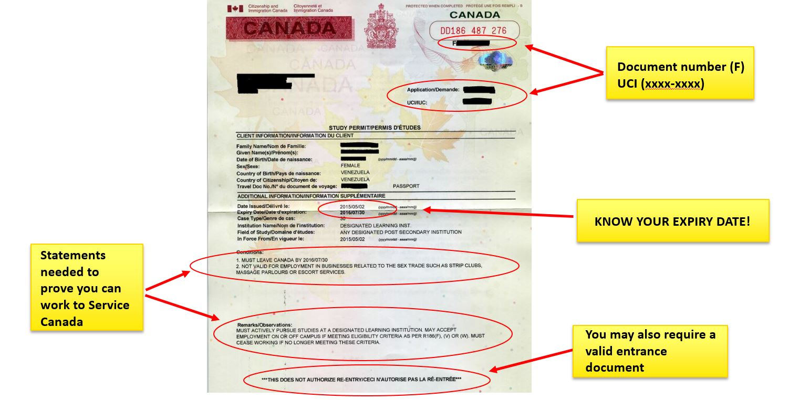

First Things First
==================
.. contents:: 
   :local:
   :depth: 2

----

Study Permit
------------

The Study Permit is almost the most important document during your studies in Canada, it legitimizes your stay in this country. Don't confuse it with your student visa, which is affixed to your passport and lets you into Canada. The Study Permit is an A4-sized document you obtain when entering the country.

.. figure:: exhibit/study_visa.jpg
   :width: 300px
   :align: center

   Student Visa (stamped on your passport) [#]_

When you get your student visa, you are eligible for Study Permit. What you need to do is to pick up the A4 size paper when you arrive in Canada, for most people, the Vancouver airport. The document you need to prepare is "letter of introduction" you received from IRCC when they issued your visa.

   Study Permit (A4-size) [#]_

The place you get the Study Permit is the Immigration office adjacent to the **No.23 baggage claim carousel** in the airport after you pass customs. There are several rows of chairs in that hall, so go in and sit down in order, and a staff member will come by to collect the documents. After that, wait for the staff to call your name at the counter. 

.. figure:: exhibit/Immigrationoffice.jpg
   :width: 600px
   :align: center

   Immigration Office at Vancouver Airport [#]_

You need to pay attention to the various possible pronunciations of your name in English. Don't expect too much from the staff's foreign language pronunciation. It often happens that some people are called several times before realizing that they are being called.

After you get your Study Permit, make sure that your name and the length of time you are allowed to stay are correct, and then you can go pick up your luggage. Considering that getting the Study Permit takes about half an hour, some people will choose to get their luggage first and put it in a corner somewhere before waiting for the Study Permit. But if you want to get the Study Permit fast, go to the office first. Remember don't walk through the gate of the exit without getting your Study Permit since it is a one-way gate.

.. note:: 
   - `IRCC: Documents you need when you arrive in Canada <https://www.canada.ca/en/immigration-refugees-citizenship/services/study-canada/study-permit/prepare-arrival.html>`_

   - `Canadian Border Service Agency: Information for international students (PDF) <https://www.cbsa-asfc.gc.ca/publications/pub/international-students-etudiants-etrangers-eng.pdf>`_

----

Work Permit
-----------

The Study Permit allows you to study in Canada, but does not authorize you to work in Canada, including part-time jobs and internships, which require a Work Permit, also a A4-size paper. Because Sauder's MBA and MBAN programs have internships in their requirements, you must also apply for a Work Permit. Some people apply for Work Permit when they apply for their visitor visa as well, then they can get both Study Permit and Work Permit when they enter the country; some others submit study purposes only when they apply for the visa, then please apply for Work Permit online after entering the country.

Most of us need a visa to enter Canada, so I'm sure you already know about the IRCC's efficiency. But rest assured, IRCC can still surprise you when applying for a Work Permit. I applied online in August but didn't receive it until January. Our internship started in April though, so it was not too late. Anyway, apply as early as you can. If you don't have a Work Permit, you might not be eligible for the internship, then you won't get the corresponding credits, which may affect your graduation.

----

MSP
---

After settling, apply for MSP (Medical Services Plan) as soon as possible. MSP is an insurance policy which costs $75 per month and will prevent you from going bankrupt due to illness. You need to wait 3 months for this card to take effect. The school will have iMed plan for each student as a transition insurance during this 3 month period. So you must apply for MSP in time to avoid gaps.

.. figure:: exhibit/msp.png
   :width: 300px
   :align: center

   MSP card [#]_

Believe me, paying for your own hospitalization must be one of the last things you want to do in Canada. A while ago, I had some tooth fillings in Vancouver. The good news is that MSP covered some of the costs, but even so, the moment I saw the bill, how can I put it, I don't think MBA tuition is that expensive anymore.

.. note:: Official Website Link: `Apply for MSP <https://www2.gov.bc.ca/gov/content/health/health-drug-coverage/msp>`_

----

**Image Source**
   .. [#] https://en.wikipedia.org/wiki/Visa_policy_of_Canada#/media/File:Student_Visa_of_Canada_Issued_on_the_PRC_Passport_in_2015.jpg

   .. [#] https://www.ucalgary.ca/live-uc-ucalgary-site/sites/default/files/teams/69/study-permit-with-info.jpg

   .. [#] https://offtracktravel.ca/arriving-vancouver-working-holiday-iec/

   .. [#] https://www2.gov.bc.ca/gov/content/governments/government-id/bc-services-card