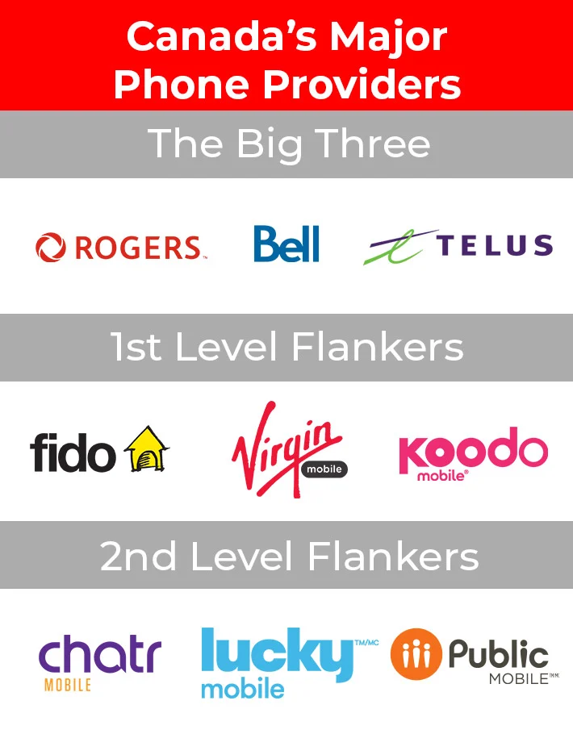

Phone SIM Card
==============

If necessary, activate your homeland SIM card for international roaming, or at least to ensure that you can receive text messages. This is so that you can, for one, receive a verification code when you sign up for an account before you buy a Canada SIM card, and in case some accounts in your home country require verification by text message.

   Canada wireless providers [#]_

While many SIM card options exist in Canada, the main carriers are Rogers, Bell, and TELUS. Affordable choices for international students include Fido, Koodo, and Lucky, which around $30-40 per month. The cheapest phone card is Public Mobile, which costs $10-15 a month but has the least airtime and traffic. Take some time to do your homework in advance, pick the best one for you, and then go to the nearest store to buy a SIM card when you arrive in Canada.

----

**Image Source**
   .. [#] https://www.cbc.ca/news/business/marketplace-high-cell-phone-bills-1.6711205