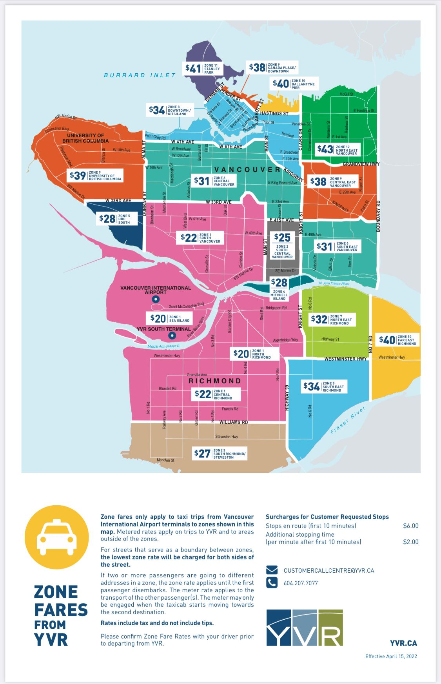

Getting Around
==============

Public Transportation
---------------------

Public Transportation: Vancouver, like many cities, offers an eco-friendly and budget-friendly mode of transportation: public transit. In addition to biking, the city's rail transit, the SkyTrain, is both punctual and efficient. One downside: UBC isn't on its current route. The good news is that UBC is on the plan of the SkyTrain route, while the bad news is that UBC students have heard this news for at least a decade.

UPASS
-----

At UBC, there's a bus loop serving as the terminus for several buses. Attention! As part of the UBC student benefits, the UPASS allows you to ride the bus/SkyTrain for FREE during your study period. To get it, purchase a Compass card and link it to your student account. You can buy one at the UBC bookstore or Shoppers on campus.

.. figure:: exhibit/compasscard.png
   :align: center
   :alt: Compass Card

   Compass Card [#]_

Actually, this isn't truly "free" - it's part of your tuition. So, don't waste it. By the way, you need to manually update your card on the UPASS website at the end of each month so that it will work the following month. On the first of every month, you can see some passengers on the bus, embarrassed to find out that the swipe card failed. To be safe, you can set an alarm each month.

.. note:: Official Website Link: `Compass Card <https://www.compasscard.ca/>`_
   
          Official Website Link: `UPASS <https://upassbc.translink.ca/>`_

One more thing, in Canada, at least in Vancouver, there is a special culture in public transportation: when you get off the bus, you need to say "thank you" loudly to the driver. I'm not kidding; it's true. Welcome to friendly Canada. But you don't have to say "thank you" to the driver on SkyTrain - after all, it's driverless.

Uber
----

Uber is a popular choice in Vancouver, with Lyft and Kabu also available. These apps are super convenient, but can be pricey.

Rent a car
----------

Vancouver is also very convenient to rent a car. The most common car rental company is EVO, which costs about 20 dollars an hour. By the way, you can get a 25 dollar coupon if you register with a refer code: XDO7VX05

.. figure:: exhibit/evo.png
   :align: center
   :alt: EVO car

   EVO car [#]_

There are also other choices, like modo, zerocar. To rent a car you need to have a local driver's license, or your home country's license plus an approved translation.

.. note:: Official Website Link: `EVO <https://evo.ca/>`_

Taxi
----

Truth be told, I've never taken a taxi in Vancouver since I have Uber on my phone. However, under certain circumstances, opting for a taxi might be a good choice. For instance, when you first arrive at Vancouver Airport and don't have a local phone number.

Below is a price map from Vancouver Airport to your destination. UBC is located in the top right corner of the map.

References
----------
   .. [#] https://www.cbc.ca/news/canada/british-columbia/preloaded-compass-cards-faredealers-1.3412249

   .. [#] https://www.vulog.com/blog/the-eco-friendly-carsharing-service-in-vancouver-evo-vulog/
   