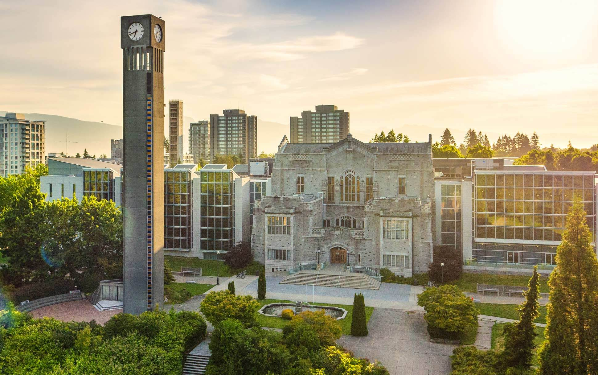
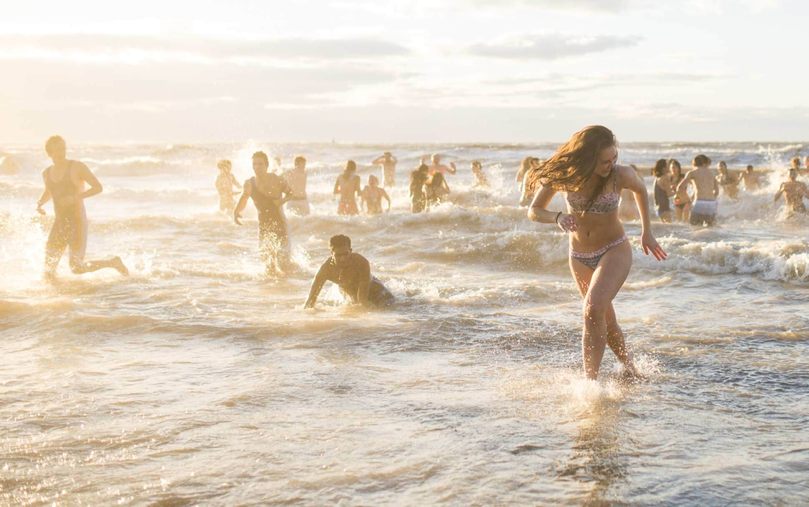

UBC Campus
==========
.. contents:: 
   :local:
   :depth: 2

UBC, often heralded as North America's most beautiful campus, offers breathtaking views of ocean and snow-covered mountains. Here are some must-visit spots on campus:

----

Sauder Business School
----------------------

You could almost call it being located right in the center of the campus. The building is right next to the most famous UBC landmark, Martha Piper Plaza(the fountain). Just beside it stands UBC's oldest structure, which now houses the School of Chemistry.

.. figure:: exhibit/sauder.jpg
   :align: center

   Sauder Business School [#]_

Most of our classes are held in the Henry Angus Bldg. On the north side of the first floor, there is the meeting rooms area, you need to swipe your student ID card to enter, and you also need to make a reservation in advance. The north side of the second floor is the library. The lounge for MBAN is on the 3rd floor, and for MBA is the 4th floor.

----

UBC Bookstore
-------------

Located on the east side of Sauder, about 1 minute away. There are a variety of UBC souvenirs inside, such as mugs, books, etc.

.. figure:: exhibit/bookstore.jpg
   :align: center

   UBC Bookstore [#]_

The most sought-after items sold at bookstore are the co-branded culture shirts between UBC and Lululemon.

   UBC & Lululemon [#]_

----

Libraries
---------

There are two libraries near Sauder, both are good places for self-study. Some movies are shot here.

   Irving K. Barber Learning Centre [#]_

Walter C. Koerner Library: 1958 Main Mall, Vancouver, BC V6T 1Z2
Irving K. Barber Learning Centre: 1961 E Mall, Vancouver, BC V6T 1Z1

----

Rose Garden
-----------

It is UBC's most famous landmark, and is 3 minutes north of Sauder, under the Canadian flag. This is the place where you can see both the ocean and the snow-capped mountains. It's small, but exquisite.

.. figure:: exhibit/rosegarden.png
   :align: center

   Rose Garden [#]_

----

Wreck Beach
-----------

Further north of the Rose Garden, a path leads to a beach. The scenery is beautiful, but Caution! This beach is a nude beach (the official describe is "clothing-optional"). You know, Canada is an extremely multicultural country, so please respect the choices of different people. 

.. figure:: exhibit/wreck.png
   :align: center

   Wreck Beach Notice[#]_

Nevertheless, you can still enjoy the scenery with your clothse. It's not mandatory for everyone entering the beach to be nude. However, you might be a little embarrassed if you haven't prepared for what you are going to see. Don't ask me how I know. I wish someone told me this the first day I arrived at UBC.

   Wreck Beach Intro [#]_

----

**Image Source**
   .. [#] https://www.sauder.ubc.ca/news/school-news/ubc-ranked-1-canada-business-administration-arwu-fifth-consecutive-year

   .. [#] https://www.archdaily.com/775763/ubc-bookstore-office-of-mcfarlane-biggar-architects-plus-designers/56278cd6e58ece127a000225-ubc-bookstore-office-of-mcfarlane-biggar-architects-plus-designers-photo?next_project=No

   .. [#]  https://gothunderbirds.ca/news/2023/2/2/general-ubc-lululemon-announce-student-scholarship-research-and-apparel-partnership.aspx

   .. [#] https://visit.ubc.ca/see-and-do/museums-and-art-galleries/irving-k-barber-learning-centre/
   
   .. [#] https://decaseconds.com/2012/08/09/ubc-rose-garden/

   .. [#] https://vancouversun.com/news/local-news/metro-seeks-more-police-patrols-on-wreck-beach-as-popularity-brings-problems

   .. [#] https://visit.ubc.ca/see-and-do/gardens-and-nature/wreck-beach/
